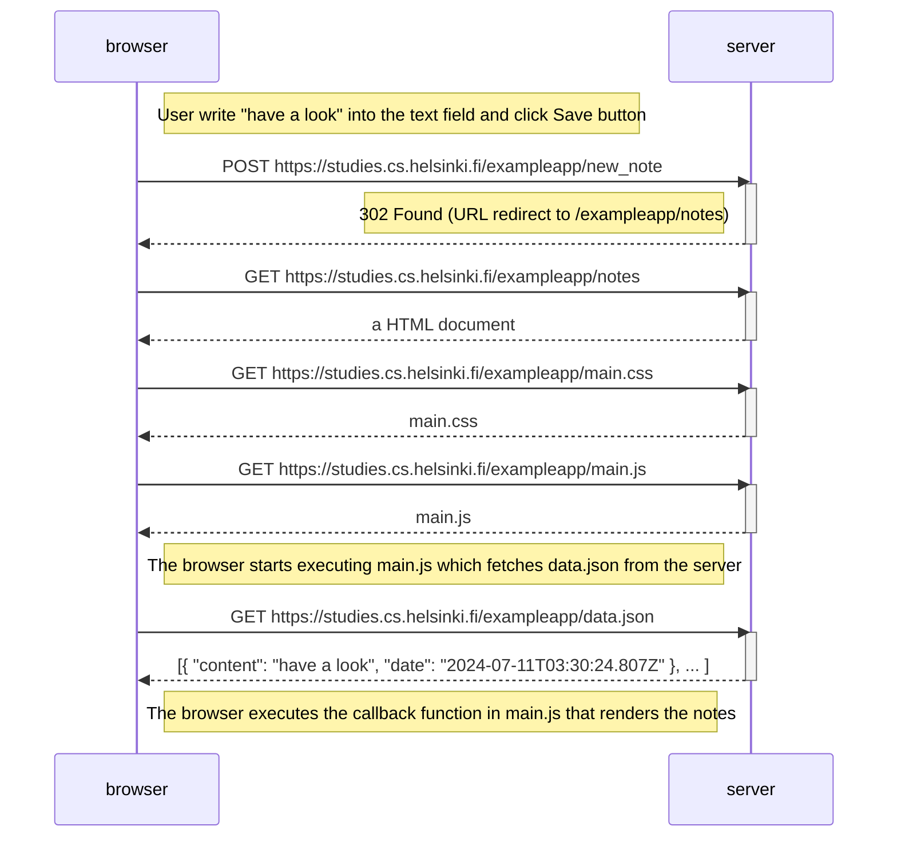

```mermaid
sequenceDiagram
    participant browser
    participant server

Note right of browser: User write "have a look" into the text field and click Save button

browser->>server: POST https://studies.cs.helsinki.fi/exampleapp/new_note
    activate server
Note left of server: 302 Found (URL redirect to /exampleapp/notes)
    server-->>browser: 
    deactivate server

browser->>server: GET https://studies.cs.helsinki.fi/exampleapp/notes
    activate server
    server-->>browser: a HTML document
    deactivate server

browser->>server: GET https://studies.cs.helsinki.fi/exampleapp/main.css
    activate server
    server-->>browser: main.css
    deactivate server

browser->>server: GET https://studies.cs.helsinki.fi/exampleapp/main.js
    activate server
    server-->>browser: main.js
    deactivate server

Note right of browser: The browser starts executing main.js which fetches data.json from the server

browser->>server: GET https://studies.cs.helsinki.fi/exampleapp/data.json
    activate server
    server-->>browser: [{ "content": "have a look", "date": "2024-07-11T03:30:24.807Z" }, ... ]
    deactivate server

Note right of browser: The browser executes the callback function in main.js that renders the notes
```
    