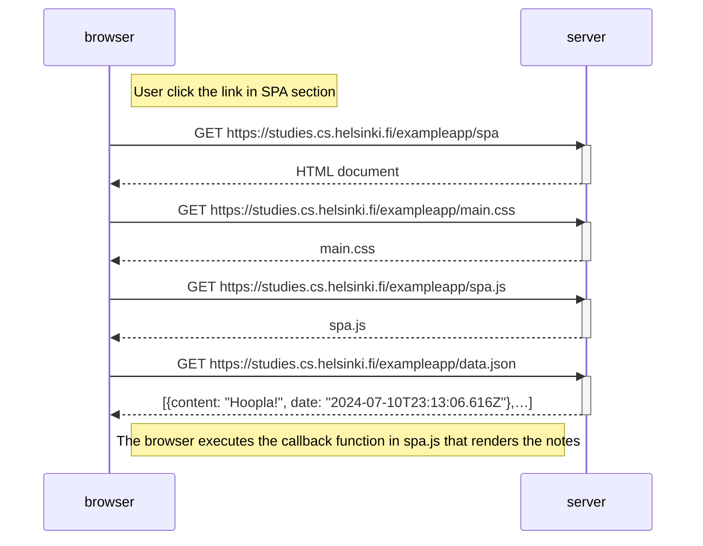

```mermaid
sequenceDiagram
  participant browser
  participant server

Note right of browser: User click the link in SPA section

browser->>server: GET https://studies.cs.helsinki.fi/exampleapp/spa
  activate server
  server-->>browser: HTML document
  deactivate server

browser->>server: GET https://studies.cs.helsinki.fi/exampleapp/main.css
  activate server
  server-->>browser: main.css
  deactivate server

browser->>server: GET https://studies.cs.helsinki.fi/exampleapp/spa.js
  activate server
  server-->>browser: spa.js
  deactivate server

browser->>server: GET https://studies.cs.helsinki.fi/exampleapp/data.json
  activate server
  server-->>browser: [{content: "Hoopla!", date: "2024-07-10T23:13:06.616Z"},…]
  deactivate server

Note right of browser: The browser executes the callback function in spa.js that renders the notes

```