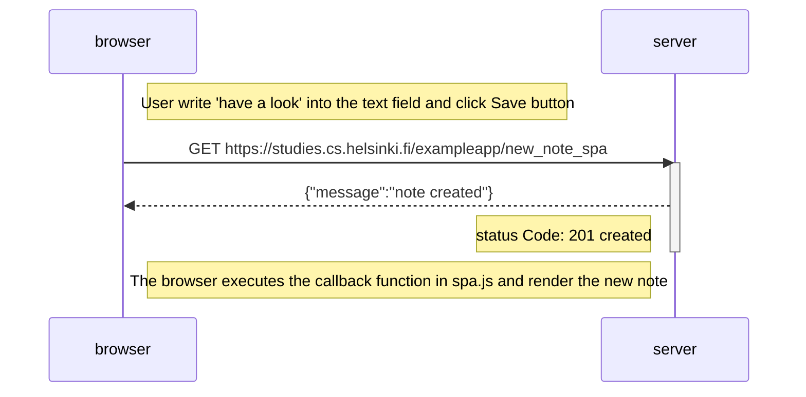

```mermaid
sequenceDiagram
  participant browser
  participant server

Note right of browser: User write 'have a look' into the text field and click Save button

browser->>server: GET https://studies.cs.helsinki.fi/exampleapp/new_note_spa
  activate server
  server-->>browser: {"message":"note created"}
  Note left of server: status Code: 201 created
  deactivate server

Note right of browser: The browser executes the callback function in spa.js and render the new note
```